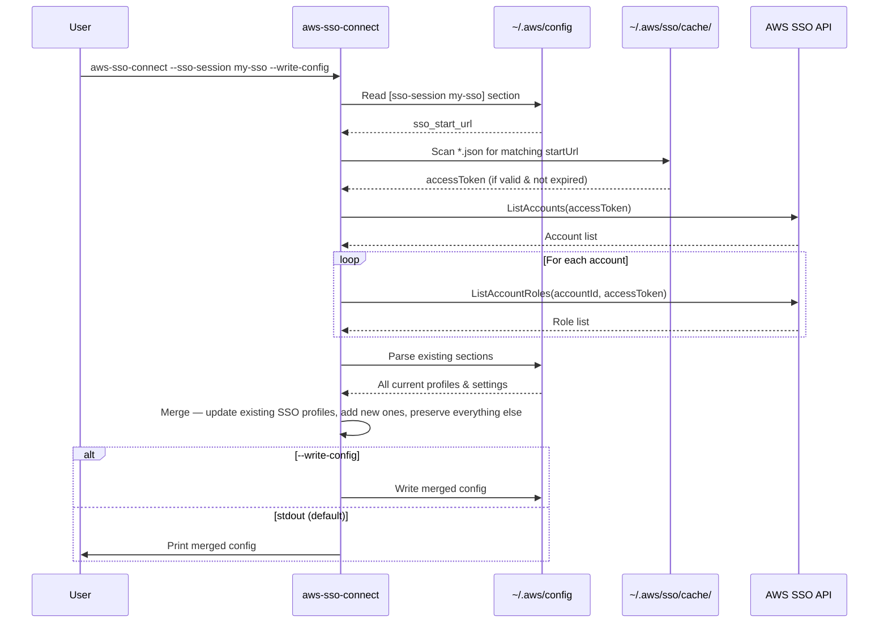

# aws-sso-connect

A cross-platform CLI utility that discovers all AWS accounts and roles available through your SSO session, then generates or updates your `~/.aws/config` with named profiles for each one.

## Prerequisites

- [Rust toolchain](https://rustup.rs/) (for building)
- [AWS CLI v2](https://docs.aws.amazon.com/cli/latest/userguide/install-cliv2.html)
- An AWS SSO session configured in `~/.aws/config`

## AWS SSO setup

Before using this utility, you need a configured SSO session and an active login.

### 1. Configure an SSO session

Run the interactive wizard:

```sh
aws configure sso
```

The wizard will prompt you for:

| Prompt | Description | Example |
|--------|-------------|---------|
| **SSO session name** | A local name for this session (reusable across profiles) | `my-sso` |
| **SSO start URL** | Your organization's AWS access portal URL (find it in the IAM Identity Center console or ask your admin) | `https://my-org.awsapps.com/start` |
| **SSO region** | The AWS region where IAM Identity Center is configured | `eu-central-1` |
| **SSO registration scopes** | OAuth scopes for the CLI (use `sso:account:access` to list accounts and roles) | `sso:account:access` |

After entering these, the CLI opens your browser for authentication, then asks you to select a default account, role, region, and output format for the initial profile.

The result is an `[sso-session]` block in `~/.aws/config`:

```ini
[sso-session my-sso]
sso_start_url = https://my-org.awsapps.com/start
sso_region = eu-central-1
sso_registration_scopes = sso:account:access
```

For full details, see the [AWS CLI SSO configuration guide](https://docs.aws.amazon.com/cli/latest/userguide/cli-configure-sso.html).

### 2. Log in

```sh
aws sso login --sso-session my-sso
```

This opens your browser for authentication and caches an access token locally. The token is typically valid for 8 hours (default: 8 hours, configurable range: 15 minutes to 90 days, set in IAM Identity Center console → Settings → Authentication → Session duration).

### 3. Run aws-sso-connect

```sh
# Preview generated profiles (prints to stdout)
aws-sso-connect --sso-session my-sso

# Write them directly to ~/.aws/config
aws-sso-connect --sso-session my-sso --write-config
```

If your token has expired, you'll see an error prompting you to run `aws sso login` again.

## Installation

### Option 1: Download pre-built binary

Download the latest binary for your platform from [GitHub Releases](https://github.com/harunhasdal/aws-sso-connect/releases), then place it on your PATH:

```sh
chmod +x aws-sso-connect
mv aws-sso-connect /usr/local/bin/
```

### Option 2: Build from source

```sh
cargo build --release

# Copy the binary somewhere on your PATH
cp target/release/aws-sso-connect /usr/local/bin/
```

## Usage

1. Log in to your SSO session:

   ```sh
   aws sso login --sso-session my-sso
   ```

2. Run the utility:

   ```sh
   # Preview what would be written (prints to stdout)
   aws-sso-connect --sso-session my-sso

   # Write directly to ~/.aws/config
   aws-sso-connect --sso-session my-sso --write-config
   ```

### Options

| Option | Required | Default | Description |
|---|---|---|---|
| `--sso-session` | Yes* | — | SSO session name; used to look up `sso_start_url` from config |
| `--start-url` | No | Auto-detected | SSO start URL (resolved from `--sso-session` if omitted) |
| `--region` | No | `eu-central-1` | AWS region for SSO API calls |
| `--output` | No | `config` | Output format: `json` or `config` |
| `--config-file` | No | `~/.aws/config` | Path to AWS config file |
| `--write-config` | No | `false` | Write merged config directly to the config file |

\* Either `--sso-session` or `--start-url` must be provided.

### Examples

```sh
# Minimal — auto-resolves start URL, writes profiles to config
aws-sso-connect --sso-session my-sso --write-config

# Output as JSON (e.g. for scripting)
aws-sso-connect --sso-session my-sso --output json

# Explicit start URL, different region
aws-sso-connect --start-url https://my-org.awsapps.com/start --region us-east-1

# Preview config changes without writing
aws-sso-connect --sso-session my-sso | diff ~/.aws/config -
```

## How it works



## Config file safety

The utility parses the entire `~/.aws/config` file into structured sections before making changes:

- **Existing non-SSO profiles** (IAM keys, assumed roles, etc.) are preserved untouched
- **Existing SSO profiles** that match a discovered account/role are updated in place (preserving any extra keys you've added like `output`, `cli_pager`, etc.)
- **New profiles** are appended at the end
- **Comments and section ordering** are maintained

## Profile naming

Profile names are derived from `{accountName}-{roleName}`, then sanitized:
- Non-alphanumeric characters (except `-` and `_`) are replaced with `_`
- Leading/trailing underscores are stripped
- The result is lowercased

Example: account "My Corp Production" with role "AdminAccess" → `[profile my_corp_production-adminaccess]`
